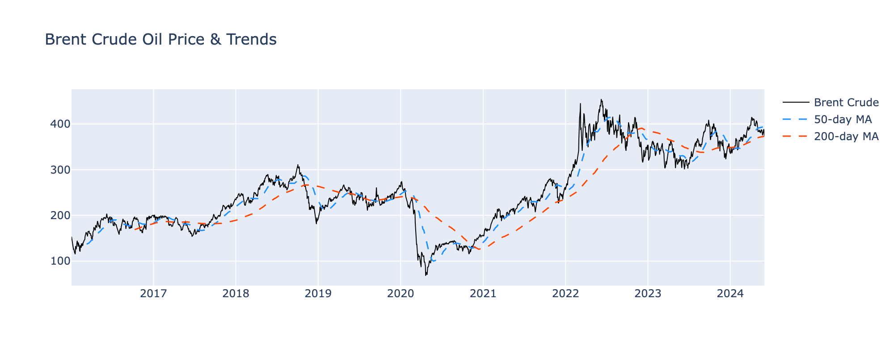
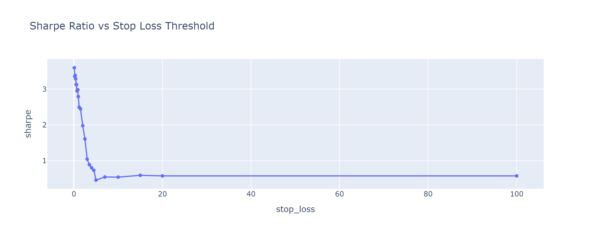
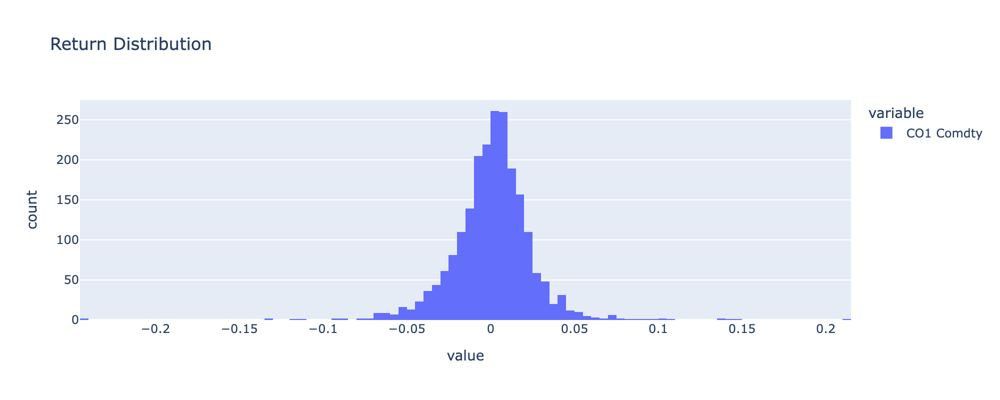
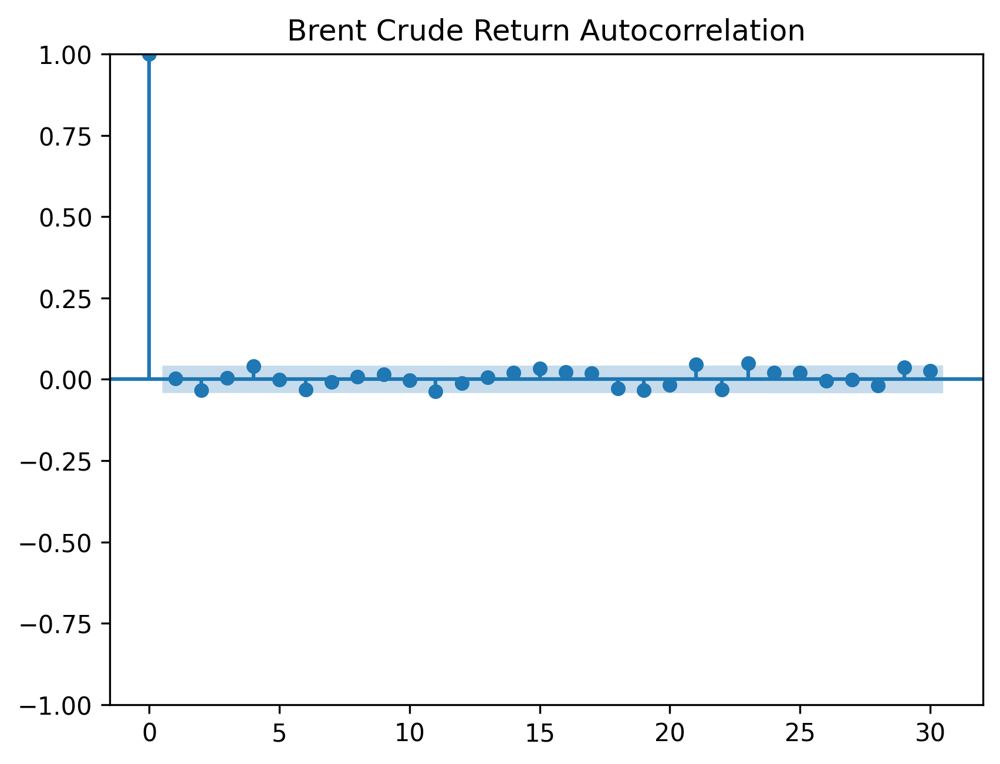

# Crude Oil Multi-Factor Walkforward Strategy

A systematic trading strategy for **Brent Crude Oil (CO1 Comdty)** that dynamically selects the best-performing signal each quarter using a walkforward backtesting framework. The strategy combines momentum, moving-average crossover, and U.S. Dollar Index signals with volatility-scaled position sizing and risk management overlays.

> **Disclaimer:** The strategy logic, hypothesis generation, and research direction were independently developed by the author. AI assistance was utilized for code generation and syntax correction.

---

## Performance Summary

| Metric | Value |
|---|---|
| **Sharpe Ratio** | 1.11 |
| **Total Return** | 242.29% |
| **Annualized Return** | 15.50% |
| **Max Drawdown** | -16.80% |

### Performance Charts

| | |
| :--- | :--- |
|  |  |
|  |  |
|  |  |
|  | |

---

## How It Works

The notebook (`learn.ipynb`) walks through the entire research process from EDA to final strategy. Here's the high-level flow:

```mermaid
graph TD
    A[Raw Price Data (Brent Crude, DXY)] --> B[14 Trading Strategies]
    B --> C[Risk Management Overlays]
    C --> D[Walkforward Backtester]
    D --> E[Portfolio Returns]
```

### Signal Families

| Family | Variants | Description |
| :--- | :--- | :--- |
| **Momentum** | 20D, 30D, 60D, 120D, 200D | Go long if N-day return is positive, short otherwise |
| **MA Crossover** | 6 pairs | Go long when fast MA crosses above slow MA |
| **DXY (Dollar Index)** | 3 pairs | Go long on oil when the dollar is weakening |

### Strategy Parameters

| Parameter | Value |
| :--- | :--- |
| Transaction Cost | 1.5 bps per trade |
| Volatility Target | 15% annualized |
| Stop Loss | -3% cumulative trade return |
| Min Holding Period | 10 days |
| Lookback Period | 12 months |
| Rebalance Frequency | Quarterly |

---

## Key Findings from EDA

- **Autocorrelation:** No significant daily return autocorrelation, so short-lookback strategies (1D, 5D, 10D) were dropped.
- **Volatility Clustering:** Extreme clustering confirmed the need for volatility-scaled position sizing.
- **Fat Tails:** Negative skew and high kurtosis justified the use of stop losses.
- **Mean Reversion:** Didn't work for crude oil (it's just the negation of momentum, no independent information).
- **Seasonality:** No reliable monthly pattern found in 8 years of data.
- **DXY Signal:** Dollar index strategies contributed ~47% of the strategy's active time, providing genuine cross-asset diversification.
- **EIA Inventories:** Weak signal, not strong enough for standalone daily trading.

For the full analysis, see the [Strategy Report](Strategy_Report.md).

---

## Project Structure

| File | Description |
| :--- | :--- |
| `learn.ipynb` | Main notebook: EDA, strategy construction, backtesting, and analysis. |
| `brent_index.xlsx` | Brent Crude Oil front-month futures price data. |
| `dxy.csv` | U.S. Dollar Index (DTWEXBGS) data from FRED. |
| `psw01.xls` | EIA Weekly Petroleum Status Report (inventory data). |
| `Strategy_Report.md` | Detailed research report documenting methodology and findings. |
| `requirements.txt` | Python dependencies. |
| `equity_curve.png` | Exported equity curve chart. |
| `drawdown.png` | Exported drawdown chart. |
| `stoploss_sensitivity.png` | Exported stop-loss sensitivity chart. |
| `equity_curve.csv` | Daily portfolio cumulative returns. |

---

## Quick Start

### 1. Set up the environment

```bash
python3 -m venv .venv
source .venv/bin/activate
pip install -r requirements.txt
```

### 2. Run the notebook

Open `learn.ipynb` in Jupyter or VS Code and run all cells.

---

## Future Improvements

- [ ] Term structure signal (contango/backwardation)
- [ ] WTI-Brent spread (inter-commodity arbitrage)
- [ ] VIX-based regime filtering (risk-on/risk-off)
- [ ] Grid search optimization for stop loss, min hold, and vol target
- [ ] Multi-asset expansion (WTI, Natural Gas, Heating Oil)

---

## License

This project is for educational and research purposes.
