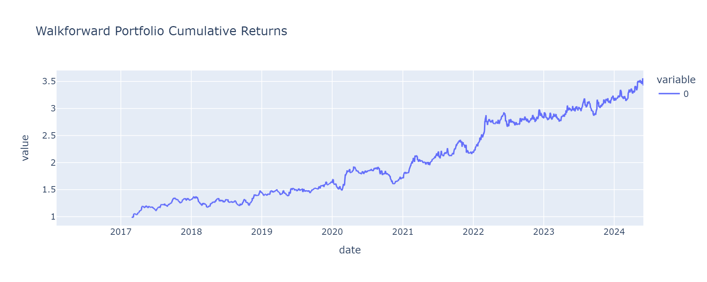
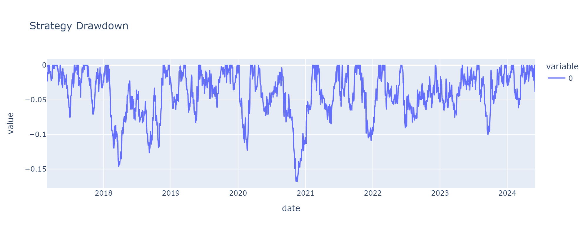

# Crude Oil Multi-Factor Walkforward Strategy

A systematic trading strategy for **Brent Crude Oil (CO1 Comdty)** that dynamically selects the best-performing signal each quarter using a walkforward backtesting framework. The strategy combines momentum, moving-average crossover, and U.S. Dollar Index signals with volatility-scaled position sizing and risk management overlays.

> **Disclaimer:** The strategy logic, hypothesis generation, and research direction were independently developed by the author. AI assistance was utilized for code generation and syntax correction.

---

## 1. Performance Summary

The strategy demonstrates robust out-of-sample performance, significantly outperforming a buy-and-hold approach.

| Metric                      | Value   |
| :-------------------------- | :------ |
| **Sharpe Ratio**      | 1.11    |
| **Total Return**      | 242.29% |
| **Annualized Return** | 15.50%  |
| **Max Drawdown**      | -16.80% |

### Equity Curve vs Drawdown




---

## 2. How It Works

The notebook (`Strategy.ipynb`) walks through the entire research process from EDA to final strategy

### Signal Families

| Family                       | Variants                  | Description                                          |
| :--------------------------- | :------------------------ | :--------------------------------------------------- |
| **Momentum**           | 20D, 30D, 60D, 120D, 200D | Go long if N-day return is positive, short otherwise |
| **MA Crossover**       | 6 pairs                   | Go long when fast MA crosses above slow MA           |
| **DXY (Dollar Index)** | 3 pairs                   | Go long on oil when the dollar is weakening          |

### Strategy Parameters

| Parameter           | Value                       |
| :------------------ | :-------------------------- |
| Transaction Cost    | 1.5 bps per trade           |
| Volatility Target   | 15% annualized              |
| Stop Loss           | -3% cumulative trade return |
| Min Holding Period  | 10 days                     |
| Lookback Period     | 12 months                   |
| Rebalance Frequency | Quarterly                   |

---

## 4. Project Structure

| File                   | Description                                                           |
| :--------------------- | :-------------------------------------------------------------------- |
| `learn.ipynb`        | Main notebook: EDA, strategy construction, backtesting, and analysis. |
| `brent_index.xlsx`   | Brent Crude Oil front-month futures price data.                       |
| `dxy.csv`            | U.S. Dollar Index (DTWEXBGS) data from FRED.                          |
| `psw01.xls`          | EIA Weekly Petroleum Status Report (inventory data).                  |
| `Strategy_Report.md` | Detailed research report documenting methodology and findings.        |
| `requirements.txt`   | Python dependencies.                                                  |

---

## 5. Quick Start

### Set up the environment

```bash
python3 -m venv .venv
source .venv/bin/activate
pip install -r requirements.txt
```

### Run the notebook

Open `learn.ipynb` in Jupyter or VS Code to reproduce the analysis.

---

## License

This project is for educational and research purposes.

<style>#mermaid-1771457454887{font-family:sans-serif;font-size:16px;fill:#333;}#mermaid-1771457454887 .error-icon{fill:#552222;}#mermaid-1771457454887 .error-text{fill:#552222;stroke:#552222;}#mermaid-1771457454887 .edge-thickness-normal{stroke-width:2px;}#mermaid-1771457454887 .edge-thickness-thick{stroke-width:3.5px;}#mermaid-1771457454887 .edge-pattern-solid{stroke-dasharray:0;}#mermaid-1771457454887 .edge-pattern-dashed{stroke-dasharray:3;}#mermaid-1771457454887 .edge-pattern-dotted{stroke-dasharray:2;}#mermaid-1771457454887 .marker{fill:#333333;}#mermaid-1771457454887 .marker.cross{stroke:#333333;}#mermaid-1771457454887 svg{font-family:sans-serif;font-size:16px;}#mermaid-1771457454887 .label{font-family:sans-serif;color:#333;}#mermaid-1771457454887 .label text{fill:#333;}#mermaid-1771457454887 .node rect,#mermaid-1771457454887 .node circle,#mermaid-1771457454887 .node ellipse,#mermaid-1771457454887 .node polygon,#mermaid-1771457454887 .node path{fill:#ECECFF;stroke:#9370DB;stroke-width:1px;}#mermaid-1771457454887 .node .label{text-align:center;}#mermaid-1771457454887 .node.clickable{cursor:pointer;}#mermaid-1771457454887 .arrowheadPath{fill:#333333;}#mermaid-1771457454887 .edgePath .path{stroke:#333333;stroke-width:1.5px;}#mermaid-1771457454887 .flowchart-link{stroke:#333333;fill:none;}#mermaid-1771457454887 .edgeLabel{background-color:#e8e8e8;text-align:center;}#mermaid-1771457454887 .edgeLabel rect{opacity:0.5;background-color:#e8e8e8;fill:#e8e8e8;}#mermaid-1771457454887 .cluster rect{fill:#ffffde;stroke:#aaaa33;stroke-width:1px;}#mermaid-1771457454887 .cluster text{fill:#333;}#mermaid-1771457454887 div.mermaidTooltip{position:absolute;text-align:center;max-width:200px;padding:2px;font-family:sans-serif;font-size:12px;background:hsl(80,100%,96.2745098039%);border:1px solid #aaaa33;border-radius:2px;pointer-events:none;z-index:100;}#mermaid-1771457454887:root{--mermaid-font-family:sans-serif;}#mermaid-1771457454887:root{--mermaid-alt-font-family:sans-serif;}#mermaid-1771457454887 flowchart{fill:apa;}</style>
