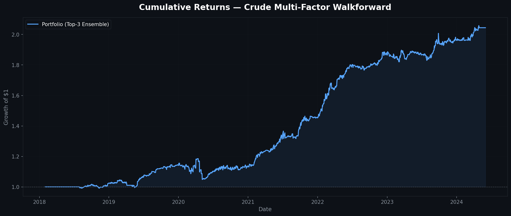
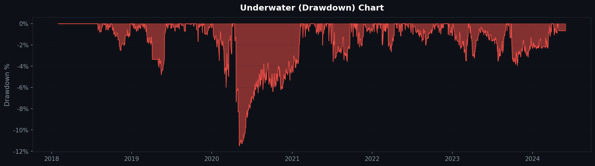
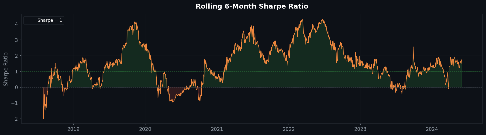
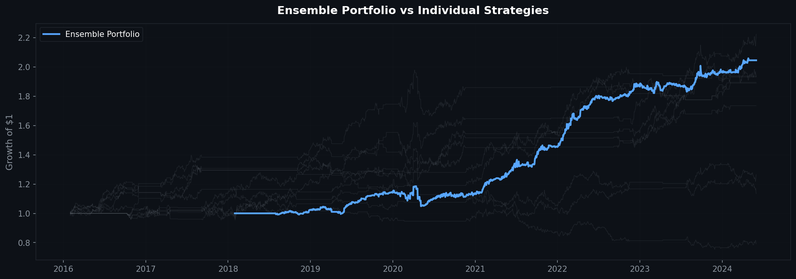

# Crude Multi-Factor Walkforward Strategy

A quantitative trading strategy for **Brent Crude Oil** that combines multiple alpha signals with walkforward optimization, Top-N strategy ensembling, volatility scaling, and regime-aware filtering.

---

## Performance Summary

| Metric | Value |
|---|---|
| **Annualized Return** | 11.64% |
| **Annualized Sharpe Ratio** | 1.40 |
| **Max Drawdown** | -11.49% |
| **Calmar Ratio** | 1.01 |
| **Total Return** | 104.45% |
| **Win Rate** | 38.97% |
| **Profit Factor** | 1.36 |

---

## Performance Charts

### Cumulative Returns


### Drawdown


### Rolling 6-Month Sharpe Ratio


### Ensemble Portfolio vs Individual Strategies


---

## Strategy Overview

The system evaluates **26 individual strategies** across 6 signal families, then uses a **walkforward backtester** to select and ensemble the Top-3 performers every quarter.

### Signal Families

| Family | Variants | Description |
|---|---|---|
| **Momentum** | 2D – 256D (8) | Go long if past N-day return > 0 |
| **Mean Reversion** | 2D – 256D (8) | Go short if past N-day return > 0 |
| **MA Crossover** | 6 pairs | Long when short MA > long MA |
| **Bollinger Band** | 20D, 50D | Long below lower band, short above upper |
| **RSI** | 14D, 28D | Long when oversold (< 30), short when overbought (> 70) |
| **Donchian Breakout** | 20D, 55D | Long on new high, short on new low |

### Risk Management & Enhancements

- **Volatility Scaling (Risk Parity)**: Position size scaled inversely to 20-day realized volatility, targeting 15% annualized vol
- **Top-N Ensembling**: Instead of picking a single winner, the top 3 strategies are equally weighted — smoothing returns and boosting Sharpe
- **Regime Filter**: Momentum strategies only active in trending markets (price > 200 SMA); mean reversion only in sideways markets
- **Minimum Holding Period**: 5-day minimum hold to prevent excessive signal flipping and reduce transaction costs
- **Stop Loss / Take Profit**: -2% stop loss and +4% take profit per trade (2:1 reward-to-risk)
- **Transaction Costs**: 1.5 bps per trade included in all backtests

---

## Architecture

```
┌─────────────────────────────────────────────┐
│              Raw Price Data                 │
│           (Brent Crude - CO1)               │
└──────────────────┬──────────────────────────┘
                   │
    ┌──────────────▼──────────────┐
    │    26 Strategy Signals      │
    │  (Momentum, MeanRev, MA,    │
    │   Bollinger, RSI, Breakout) │
    └──────────────┬──────────────┘
                   │
    ┌──────────────▼──────────────┐
    │      Signal Filters         │
    │  • Holding Period (5 day)   │
    │  • Stop Loss / Take Profit  │
    │  • Regime Filter            │
    │  • Volatility Scaling       │
    └──────────────┬──────────────┘
                   │
    ┌──────────────▼──────────────┐
    │   Walkforward Backtester    │
    │  • 24M lookback window      │
    │  • 3M rebalance frequency   │
    │  • Top-3 ensemble selection │
    └──────────────┬──────────────┘
                   │
    ┌──────────────▼──────────────┐
    │     Portfolio Returns       │
    │    (Risk-Adjusted PnL)      │
    └─────────────────────────────┘
```

---

## Quick Start

### Requirements
```bash
pip install pandas numpy plotly openpyxl nbformat matplotlib
```

### Run
Open `Sample Strategy.ipynb` in Jupyter or VS Code and run all cells.

---

## Files

| File | Description |
|---|---|
| `Sample Strategy.ipynb` | Main notebook with strategy code and backtester |
| `brent_index.xlsx` | Brent crude oil price data (CO1 Comdty) |
| `backtest.py` | Standalone backtester module |

---

## Future Improvements

- [ ] Add crude oil **inventory signal** (EIA weekly data)
- [ ] **Term structure** signal (contango/backwardation)
- [ ] Optimize `min_hold`, `stop_loss`, `take_profit` via grid search
- [ ] Walk-forward parameter optimization
- [ ] Multi-asset expansion (WTI, Natural Gas, Heating Oil)

---

## License

This project is for educational and research purposes.
